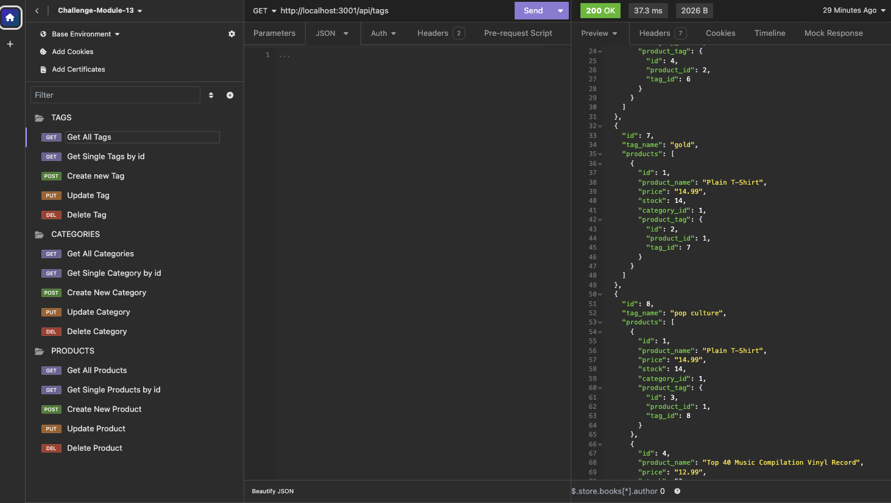

# Ecommerce-back-end-foundation

## Description

Internet retail, also known as e-commerce, plays a significant role within the electronics industry, empowering businesses and consumers alike to conveniently engage in online buying and selling of electronic products. In 2021, the e-commerce industry in the United States alone generated an estimated US$2.54 trillion, according to the United Nations Conference on Trade and Development. Platforms like Shopify and WooCommerce provide a suite of services to businesses of all sizes, highlighting the importance for developers to understand the fundamental architecture of e-commerce sites.

## Features

- Get all categories, tags, and products.
- Get category, tag, and product by ID.
- Create/Post new category, tag, and product.
- Update/Put category, tag, and product by ID.
- Delete/Del existing category, tag, and product by ID.

## Table of Contents

- [Installation](#installation)
- [Usage](#usage)
- [Credits and Stack](#credits-and-stack)
- [Contributing and Questions](#how-to-contribute-and-questions)

## Installation

### Prerequisites

Before you start, make sure you have the following installed:

- Node.Js (https://nodejs.org/en)
- PostgreSQL (https://www.postgresql.org/download/)
- Sequelize (https://sequelize.org/)
- Express.js (https://expressjs.com/)
- Inquirer (https://www.npmjs.com/package/inquirer)
- Insomnia (https://insomnia.rest/)

1. **Clone the Repository**

   ```sh
   git clone https://github.com/Alex-Design-For-Reap/Ecommerce-back-end-foundation
   ```

2. **Install Dependencies**

   ```sh
   npm install
   ```

3. **Create a `.env` file in the root directory and add your database credentials:**

   ```env
   DB_NAME=ecommerce_db
   DB_USER="your_username"
   DB_PASSWORD="your_password"
   DB_HOST=localhost
   DB_PORT=3000
   ```

4. **Seed the database**

```sh
npm run seed
```

## Usage

1. **Start the application**

   ```sh
   node server.js
   ```

2. **Open Insomnia to test the application**

   https://insomnia.rest/
   

3. **watch the video demo explaining the how to use it and the main functionality👇👇👇**

https://drive.google.com/file/d/1-KWHQZxP_8WTiNDfwIhVG-ZeJvWxVYFp/view

## Credits and Stack

- Node.Js (https://nodejs.org/en)
- PostgreSQL (https://www.postgresql.org/download/)
- Sequelize (https://sequelize.org/)
- Express.js (https://expressjs.com/)
- Inquirer (https://www.npmjs.com/package/inquirer)
- Insomnia (https://insomnia.rest/)

## How to Contribute and Questions

Contributions are welcome!
If you want to contribute or have any questions, here are my channels:
gitHub: https://github.com/Alex-Design-For-Reap/Ecommerce-back-end-foundation

email: s.alexsilva@gmail.com

Author: Alex Da Silva (https://alex-design-for-reap.github.io/Portfolio/)
